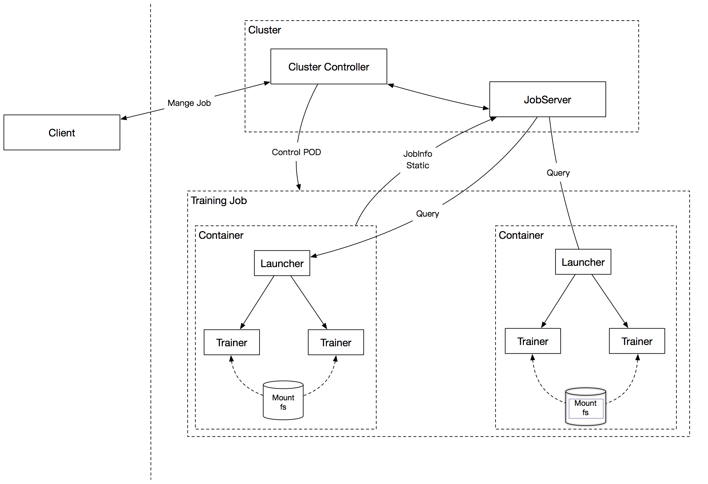
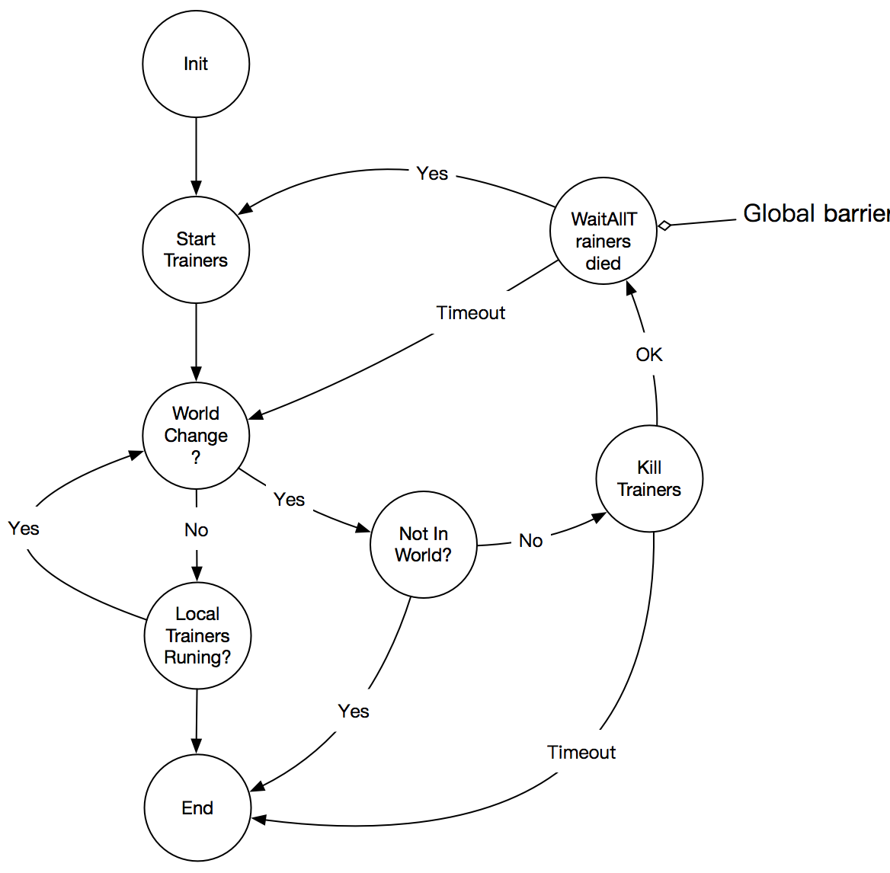
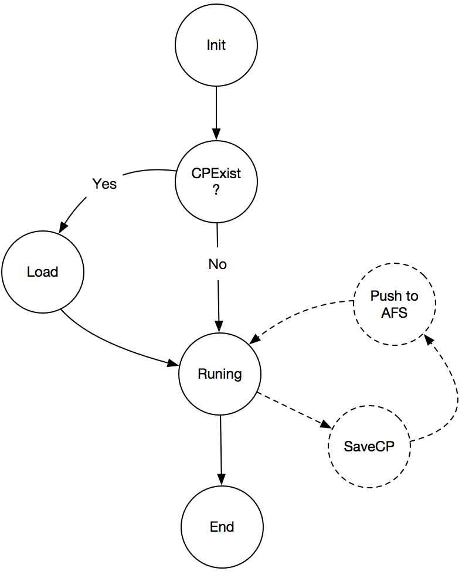

# 概述
Collective通信（同步）模式的训练因为其精度稳定、好复现的特点广泛用于图像、文本、语音等深度学习领域。
本文将阐述Collective通信模式下的EDL的设计思路和方法

# 难点
当用户把自己的单机程序改成多机程序，他的程序需要增加的唯一的超参是节点的个数，由此带来的程序的改动可能会有几个，如：数据如何切分；batchsize、learning rate类的调整。  
当用户把多机程序改成可以适应EDL的程序，需要在节点个数的基础上增加另外一个考虑：数据的一致性的问题。需要保证各处的跟节点数目相关的参数在节点变化的时候多个节点间数据是一致的。我们需要在框架端把这个考虑带来的影响减少到最小。

这带来几个难点问题：

1. 如何保存Python端的用户逻辑.   
如数据如何切分、 文件的位置、及其他的Paddle框架之外的参数等。   
这些参数是比较自由的、用户自定义的，我们在训练引擎端无法控制的。所以我们采用stop-resume的方式解决，用户程序面对新的超参只有节点个数一个。

2. 如何尽可能的保证精度、结果可复现。   
训练的任务提交之前，用户需要指定自己的训练节点的最小和最大的节点的个数，同时需要指定batchsize是保持不变还是随着节点数目线性增长，因为batchsize是精度相关的超参，有些模型超过了一定阈值就需要做额外的调整，如Resnet50 total batchsize 超过8K的时候需要对学习率做额外的调整。
但是，保持总的batchsize不变也会带来扩展的效率问题：单卡batchsize减少，训练的性能可能会降低。
考虑到上述两个问题，这个地方需要用户自己根据节点的个数和自己的模型的特点做决定。

3. 如何让用户的程序改动少。   
stop-resume的方式是需要`save_checkpoint`和`load_checkpoint`的时机。因为需要用户在Python端的显示调用，这部分很难隐藏到接口里边去。
除了这个之外，其他无改动。

4. 如何对接多个集群。
Kubernetes虽然用的越来越多，但是实际生产中会有多种类型的在线、离线集群。为了和这些集群对接，我们提出了一个中间层：Jobserver。
用这个模块来对接各种各样的集群接口。

5. 如何防止没有意义的调度。
  - 当一个训练任务临近结束的时候其实是没有必要进行伸缩的，这个时候的伸缩反而会降低效率
  - 某些场景下，需要优先scale资源利用率高的作业而不是利用率低的，这有利于整体吞吐量的提升。
考虑到上述的原因，Paddle需要把作业的性能统计信息传递给调度端以便调度进行决策.
  
 可能会有多种需要考虑的场景，而不仅仅是上述的两个。Paddle(计算引擎)需要把训练节点的信息汇报给调度端，以便于调度端做调度的决策。
 
 6. 如何做数据的切分。
 节点的变化一般会带来数据切分方式的变化。这就需要用户对数据有全局观。要么用户把数据全部下载下来，要么采用mount一个分布式的文件系统（如Ceph等）的方式。

# 方案设计
## 架构图

## Launcher module
  
Launcher模块主要负责多个trainer端的协调

## Trainer module
.  
Trainer模块主要负责EDL功能里边的`save_checkpoint` `load_checkpoint`
