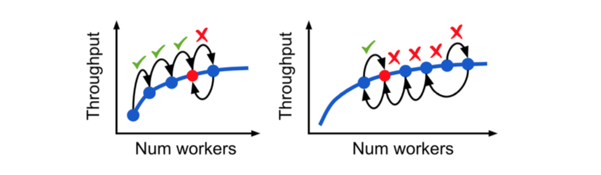

## Elastic Deep Learning Survey

This survey investigates current elastic deep learning frontiers. We focus on system architecture, training algorithm, theory of elastic deep learning. The survey will keep updated, stay tunned.

### Release notes

- release date: 2020.03.08
- research reference papers
  - [1]. Elastic Deep Learning in Multi-Tenant GPU Clusters. **arXiv 2019**
  - [2]. Resource Elasticity In Distributed Deep Learning. **MLSys 2020**
  - [3]. Dynamic Mini-batch SGD for Elastic Distributed Training: Learning in the Limbo of Resources. **arXiv 2019**

## Summary

#### Overview

* Elastic Deep Learning concerns about the distributed training under elastic resources. Inference work is not covered currently, but should be more easy to deploy given an elastic training system.
* Benefits of Elastic Deep Learning
  * Straggler mitigation. [2]
  * Job level benefits: Adjusting trade-off between throughput and efficiency [1]. Cost saving for users. [2]
  * Cluster level benefits: Cluster utilization and JCT. [1]
  * Utilize transient idle resources. [1]
* Limitation of current deep learning framework in elastic deep learning
  * Tensorflow: Static graph with send/recv op, graph can not be changed in runtime
    * Community solution: https://github.com/sql-machine-learning/elasticdl
    * Research: Use horovod to add elastic training. [1] [2]
  * Pytorch: dynamic graph execution but distributed node number is fixed before launching the job.
    * Pytorch official solution: https://github.com/pytorch/elastic
* Two main issues elastic deep learning should solve
  * How to schedule elasitc resource for a training job, i.e., add news workers and remove existing workers? 
  * How to adapt the batch size for each worker under elastic training resources?

#### Key problems in elastic deep learning

* How to schedule elastic resources for a training job?

  * AutoScaling Engine proposed by [2]. 

    * AutoScaling Engine mainly works on synchronous training with AllReduce. 

    * Try to mimic trial-and-error approach to find the best resource allocations for training

    * Heuristic Scaling Schedule: Scaling out or scaling in by N workers every K steps.

    * Scaling Conditions 1: throughput scaling efficiency

      

    * Scaling Conditions 2: utility v.s cost. useful for cloud users.

    * Straggler detection: persistent workers will be replaced if the straggler detection algorithm find stragglers.

    

    

  * Limitation of AutoScaling Engine:

    * When a GPU cluster is full of jobs, how to do efficient scale out and scale in? should we compare scale conditions between jobs to decide the priority of scaling?

  * EDL API proposed by [1]

    * A system design overview.

    * No central node, leader of current job is dynamic decided by etcd or ZooKeeper. Each worker can request the current leader of the job. Every work can be a leader of current job.

    * Stop-free scaling

      

    * Dynamic data pipeline

      * Partition the data logically with files or offset. The leader will assign the data partition each worker should train. 
      * A worker should report the partition offset at every mini-batch. The leader consitently holds data partition information. When a leader leaves, it should copy the hold training progress to the new leader.

    * EDL API: somehow like horovod or fleet

      

    * Limitation of this work: 

      * The system has to work with cluster, in this work, the authors develop the EDL with Tiresias https://github.com/SymbioticLab/Tiresias
      * Complexity is more than benefits.
      * Data pipeline API design is good, but may not be very efficient. The training system highly relys on the stability of the data pipeline, may be very hard to do debugging for researchers.

* How to adapt the batch size for each worker under elastic training resources?

  * Batch size adaptation in AutoScaling Engine

    * The authors state that 'We accept a maximum global batch size from the user and fix the local batch size until this threshold is crossed'
    * Limitation: How can a user decide the maximum global batch size without trial-and-error effort.
    * One more Limitation: To ensure the convergence of a training model, the maximum global batch will be small, thus it's very hard to scale out considering the throughput and efficiency of training. 
    * How to change the learning rate during auto-scaling？The author needs some algorithmic discussion.

  * Dynamic Mini-batch SGD proposed by [3]

    * This work mainly focuses on how to change the training hyper-parameters, in particular batch size and momentum scaling factor for computer vision tasks.

    * Global Batch Size and Local Batch Size

      * Fix the global batch size mostly garentees the convergence of training models. (performance some models such as Resnet50 will be affected by local batch normalization)
      * Fixed global batch size means small local batch size when we scale out. Throughputs can be affected.
      * Fix the local batch size, convergence of the model will be affected. A common way is to linearly increase the learning rate, but experiments show that training performance will be degraded.

    * Dynamic mini-batch SGD approach

      * When training with mini-batch SGD on computer vision tasks such as image classification, object detection, momentum with SGD is used commonly.

        

      * When batch size is changed, the optimization algorithm becomes

        

        

      * Since the $v_t$ keeps the exponentially weighted past gradient estimates, the noise of momentum is $k^2$ factor. Thus, to do momentum compensation, the authors propose

        

        $T=8$ works well in practice
